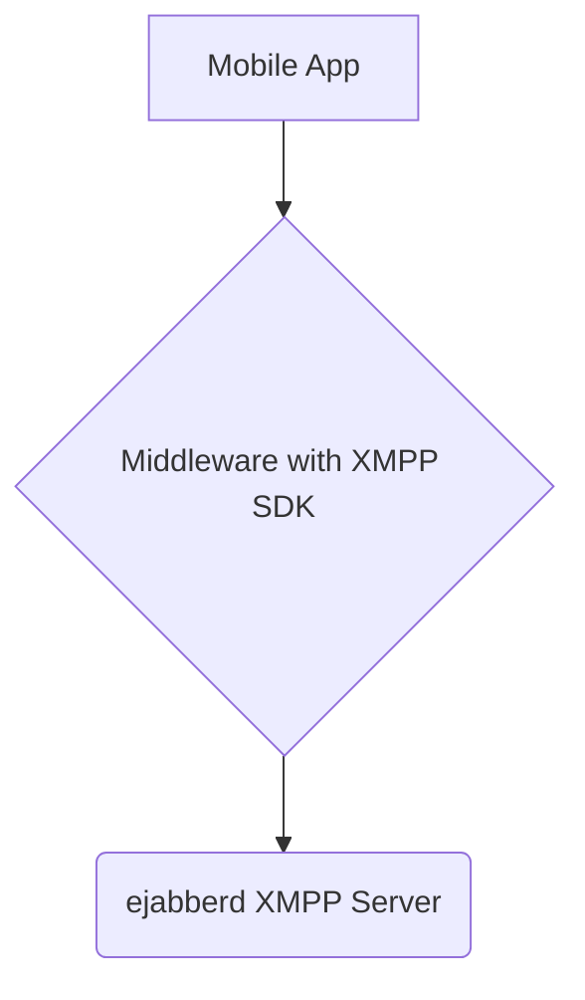

# ejabberd Helm Chart: Project Overview

This document outlines the architecture and development plan for creating a production-ready, highly configurable Helm chart for deploying the ejabberd XMPP server.

## 1. Architecture

The overall system architecture consists of three main components:

1.  **Mobile App**: The end-user application that provides the chat interface.
2.  **Middleware**: A service layer that integrates with an XMPP client SDK. It handles user authentication, business logic, and communication with the ejabberd server.
3.  **ejabberd Server**: The core XMPP server responsible for message routing, presence, and real-time communication.

**The focus of this project is to build and package the `ejabberd Server` component as a robust and flexible Helm chart.**

## 2. Development Approach: Test-Driven Development (TDD)

We will follow a TDD methodology to ensure the Helm chart is reliable, verifiable, and meets all requirements. The development is broken down into the following phases:

### Phase 1: Discovery and Test Definition
*   **Research ejabberd API**: Thoroughly review the ejabberd REST API documentation to identify all administrative endpoints required for managing the server (e.g., user creation, server status, etc.).
*   **Write Hurl Tests**: Develop a comprehensive suite of `.hurl` tests that define the expected behavior of these API endpoints. These tests will serve as the acceptance criteria for our implementation and will fail initially.

### Phase 2: Scaffolding and Stubbing
*   **Helm Chart Scaffolding**: Create the basic directory structure for a new Helm chart (`ejabberd/`).
*   **Initial Kubernetes Manifests**: Write the initial set of Kubernetes manifests (`Deployment`, `Service`, `ConfigMap`) that define the basic resources needed to run a service.
*   **Stub Implementation**: To validate our test setup and basic networking, we will initially deploy a simple mock server. This server will be configured to return successful (but empty) responses, allowing our Hurl tests to pass. This confirms the testing pipeline is sound before introducing the complexity of ejabberd.

### Phase 3: Full Implementation and Verification
*   **ejabberd Integration**: Replace the mock server with the official `ejabberd/ecs` container image.
*   **Configuration Management**: Develop a comprehensive `values.yaml` file to expose all necessary ejabberd configuration options. This will include settings for XMPP domains, admin users, database connections, and resource limits.
*   **Iterate and Test**: Deploy the chart to a local Kubernetes cluster (e.g., Minikube, Kind). Continuously run the Hurl tests and refine the Helm templates and configuration until all tests pass against the live ejabberd instance.

### Phase 4: GKE Deployment and Final Documentation
*   **Adapt for GKE**: Address any Google Kubernetes Engine (GKE) specific requirements, such as creating `Ingress` resources for external access and configuring persistent volumes using GCE Persistent Disks.
*   **Finalize Documentation**: Create a detailed `README.md` within the chart directory, providing clear instructions for installation, configuration, and usage for both local and GKE environments.

By following this plan, we will produce a well-tested, easy-to-use, and production-ready Helm chart for ejabberd. 