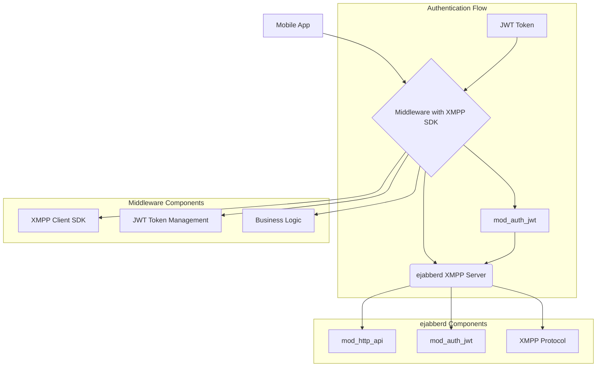

# ejabberd Helm Chart: Project Overview

This document outlines the architecture and development plan for creating a production-ready, highly configurable Helm chart for deploying the ejabberd XMPP server.

## 1. Architecture

The overall system architecture consists of three main components:



### Component Details:

1. **Mobile App**: The end-user application that provides the chat interface and user authentication.

2. **Middleware**: A service layer that integrates with an XMPP client SDK. It handles:
   - **User Authentication**: Generates and manages JWT tokens
   - **XMPP SDK Integration**: Connects to ejabberd using JWT authentication
   - **Business Logic**: Handles chat room management, user presence, etc.
   - **JWT Token Management**: Creates tokens with user claims and expiration

3. **ejabberd Server**: The core XMPP server with enhanced authentication:
   - **mod_auth_jwt**: Validates JWT tokens for XMPP authentication
   - **mod_http_api**: Provides REST API for administrative operations
   - **XMPP Protocol**: Handles real-time messaging, presence, and chat rooms

### JWT Authentication Flow:

1. **User Login**: Mobile app authenticates with middleware
2. **JWT Generation**: Middleware creates JWT token with user claims
3. **XMPP Connection**: Middleware's XMPP SDK connects to ejabberd using JWT token
4. **Token Validation**: ejabberd's `mod_auth_jwt` validates the token
5. **XMPP Session**: User is authenticated and can send/receive messages

### JWT Implementation Details:

**Shared Secret Management:**
```
SECRET = "your-super-secret-key-here"  // Same secret on both sides
```

**Middleware (Client Side) - JWT Generation:**
```javascript
// 1. User logs in to middleware
const user = authenticateUser(username, password);

// 2. Middleware generates JWT token
const jwtPayload = {
  sub: "user123@localhost",     // XMPP JID (username@host)
  exp: Date.now() + 3600000,    // Expires in 1 hour
  iss: "middleware-app",        // Issuer (middleware identity)
  iat: Date.now()               // Issued at timestamp
};

// 3. Sign JWT with shared secret
const jwtToken = jwt.sign(jwtPayload, SECRET, { algorithm: 'HS256' });

// 4. XMPP SDK connects using JWT as password
xmpp.connect({
  username: "user123",
  password: jwtToken,           // JWT token becomes the password
  host: "localhost"
});
```

**ejabberd (Server Side) - JWT Validation:**
```yaml
# ejabberd configuration
modules:
  mod_auth_jwt:
    secret: "your-super-secret-key-here"  # Same secret as middleware
    algorithm: "HS256"
    user_claim: "sub"                     # JWT field containing XMPP JID
    issuer: "middleware-app"              # Expected issuer
```

**ejabberd Validation Process:**
```javascript
// 1. XMPP client sends JWT token as password
// 2. ejabberd extracts JWT from password field
// 3. mod_auth_jwt validates the token:

function validateJWT(jwtToken) {
  // Step 1: Verify signature with shared secret
  const decoded = jwt.verify(jwtToken, SECRET, { algorithm: 'HS256' });
  
  // Step 2: Check expiration
  if (decoded.exp < Date.now()) {
    throw new Error("Token expired");
  }
  
  // Step 3: Verify issuer
  if (decoded.iss !== "middleware-app") {
    throw new Error("Invalid issuer");
  }
  
  // Step 4: Extract user from JWT
  const xmppJid = decoded.sub;  // "user123@localhost"
  const username = xmppJid.split('@')[0];  // "user123"
  
  // Step 5: Allow XMPP connection for validated user
  return username;
}
```

**Security Model:**
- **Shared Secret**: Only middleware and ejabberd know the secret
- **Token Expiration**: Tokens automatically expire (no persistent sessions)
- **Issuer Validation**: Only trusted middleware can create valid tokens
- **No Password Storage**: ejabberd doesn't store passwords, JWT is the proof

**The focus of this project is to build and package the `ejabberd Server` component as a robust and flexible Helm chart with JWT authentication support.**

## 2. Quick Start

**Automated deployment and testing:**
```bash
./setup-and-test.sh    # Deploy, test, and verify
./teardown.sh          # Clean up everything
```

**Manual deployment:**
```bash
helm install my-ejabberd ./ejabberd
kubectl port-forward service/my-ejabberd 5280:5280 &
hurl --variables-file tests/vars.env --test --jobs 1 tests/*.hurl
```

## 3. Development Approach: Test-Driven Development (TDD)

We will follow a TDD methodology to ensure the Helm chart is reliable, verifiable, and meets all requirements. The development is broken down into the following phases:

### Phase 1: Discovery and Test Definition ✅ COMPLETED
*   **Research ejabberd API**: Thoroughly review the ejabberd REST API documentation to identify all administrative endpoints required for managing the server (e.g., user creation, server status, etc.).
*   **Write Hurl Tests**: Develop a comprehensive suite of `.hurl` tests that define the expected behavior of these API endpoints. These tests will serve as the acceptance criteria for our implementation and will fail initially.

### Phase 2: Scaffolding and Stubbing ✅ COMPLETED
*   **Helm Chart Scaffolding**: Create the basic directory structure for a new Helm chart (`ejabberd/`).
*   **Initial Kubernetes Manifests**: Write the initial set of Kubernetes manifests (`Deployment`, `Service`, `ConfigMap`) that define the basic resources needed to run a service.
*   **Stub Implementation**: To validate our test setup and basic networking, we will initially deploy a simple mock server. This server will be configured to return successful (but empty) responses, allowing our Hurl tests to pass. This confirms the testing pipeline is sound before introducing the complexity of ejabberd.

### Phase 3: Full Implementation and Verification ✅ COMPLETED
*   **ejabberd Integration**: Replace the mock server with the official `ejabberd/ecs` container image.
*   **Configuration Management**: Develop a comprehensive `values.yaml` file to expose all necessary ejabberd configuration options. This will include settings for XMPP domains, admin users, database connections, and resource limits.
*   **Iterate and Test**: Deploy the chart to a local Kubernetes cluster (e.g., Minikube, Kind). Continuously run the Hurl tests and refine the Helm templates and configuration until all tests pass against the live ejabberd instance.

### Phase 4: JWT Authentication and Middleware Integration 🔄 IN PROGRESS
*   **JWT Module Configuration**: Enable and configure `mod_auth_jwt` in ejabberd
*   **JWT Secret Management**: Implement secure JWT secret handling in the Helm chart
*   **Middleware Integration Tests**: Create tests for JWT-based XMPP authentication
*   **Documentation**: Update documentation with JWT configuration examples

### Phase 5: GKE Deployment and Final Documentation
*   **Adapt for GKE**: Address any Google Kubernetes Engine (GKE) specific requirements, such as creating `Ingress` resources for external access and configuring persistent volumes using GCE Persistent Disks.
*   **Finalize Documentation**: Create a detailed `README.md` within the chart directory, providing clear instructions for installation, configuration, and usage for both local and GKE environments.

By following this plan, we will produce a well-tested, easy-to-use, and production-ready Helm chart for ejabberd with JWT authentication support for middleware integration. 